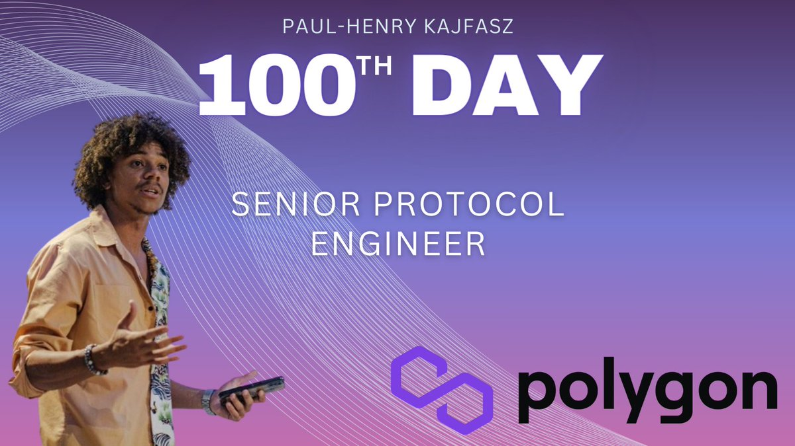
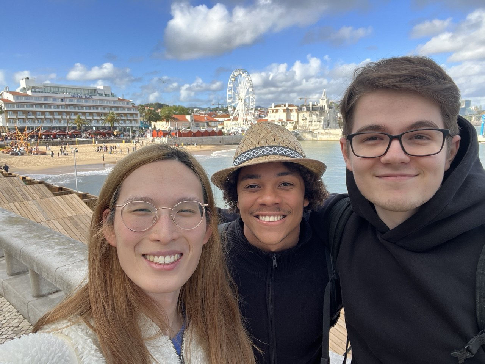
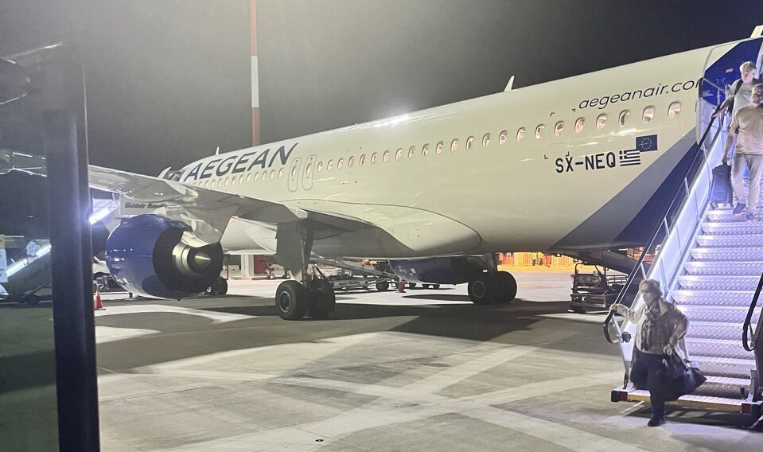
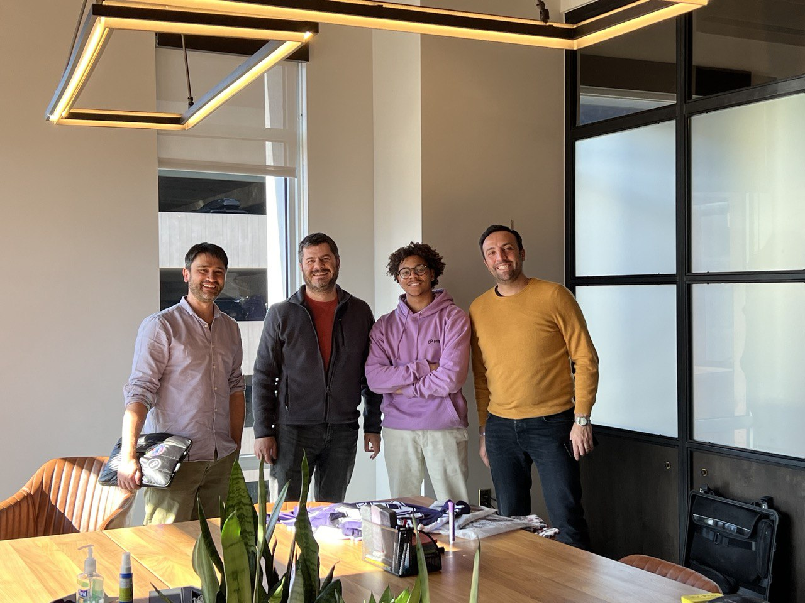
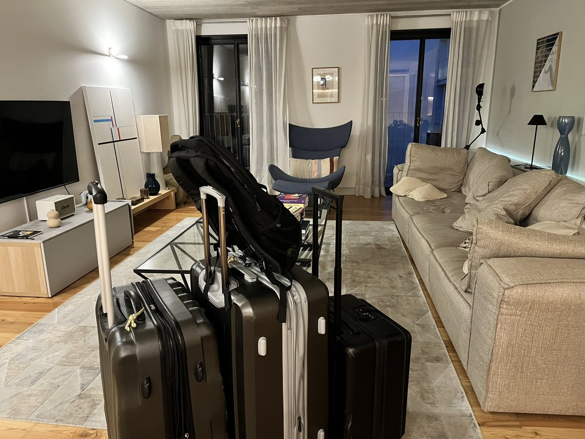
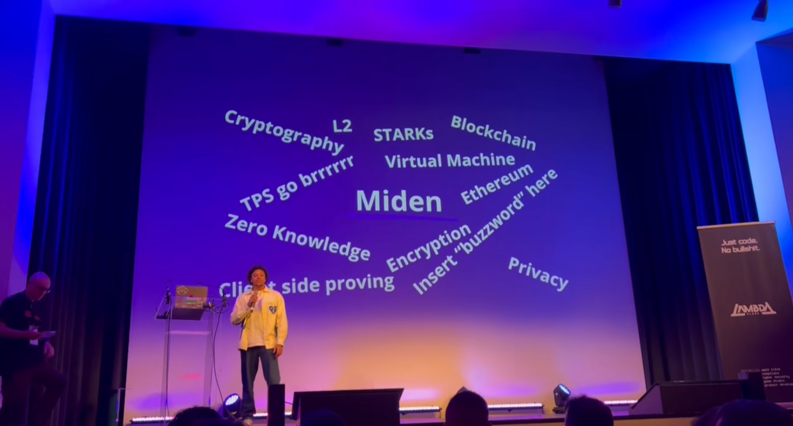
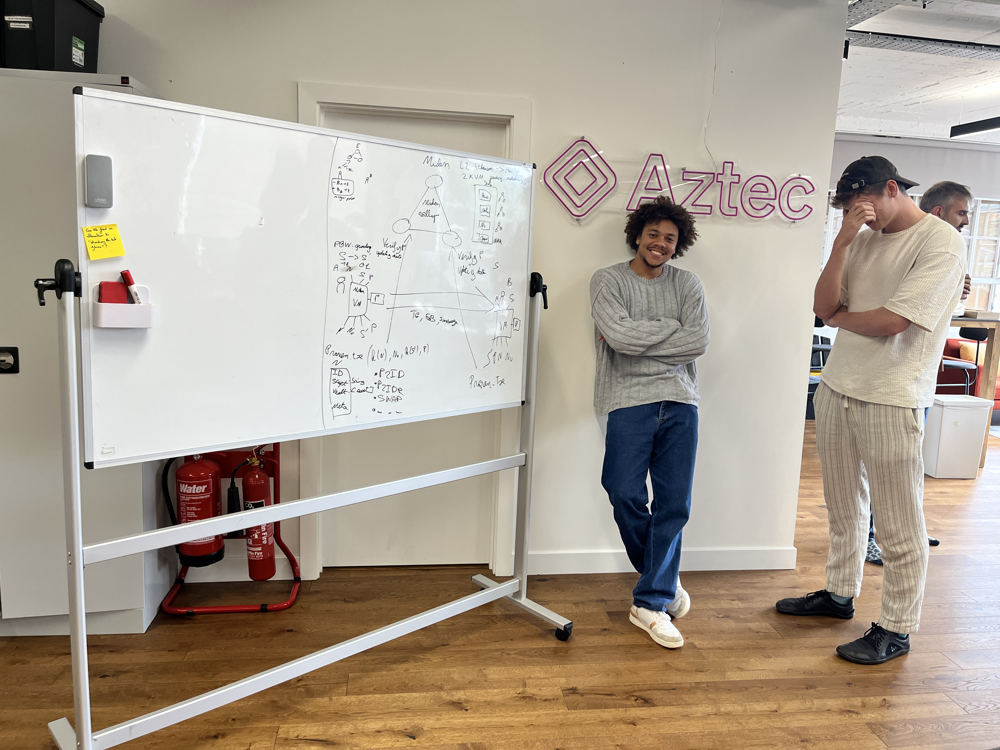
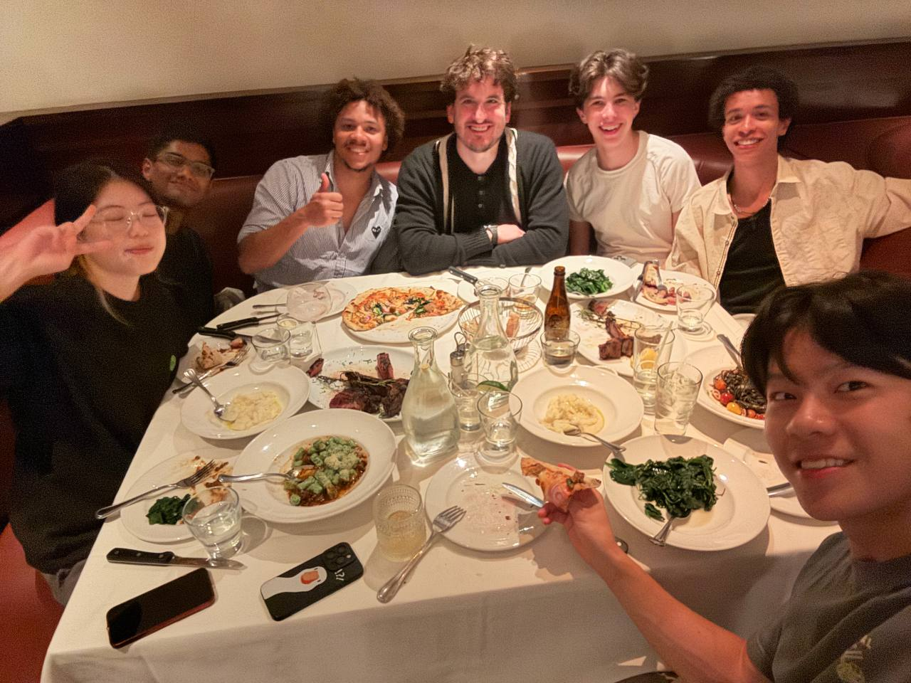
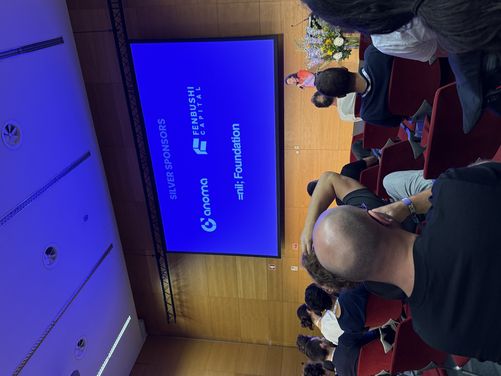
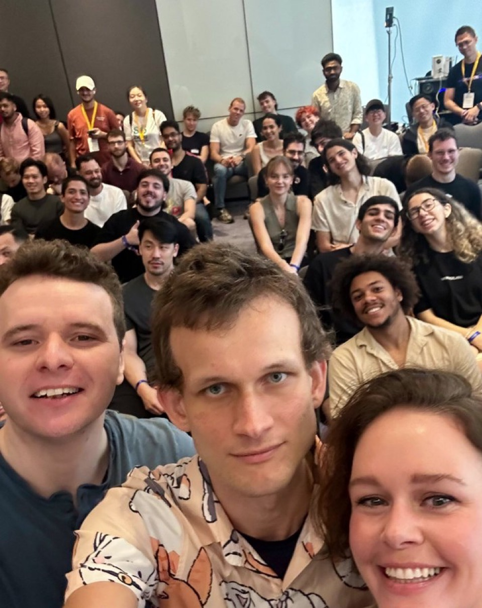

# Reflecting on 2024

> The year of discovery

This year has been the most intense of my life. Full of novelty, learnings, successes, ups and downs.

I want to reflect on what happened this year, how did it impact me, and what do I envision for 2025.

## 5 Accomplishments

> Be grateful, be proud, be kind

- Improved my relationships with both my mother and other family members
- Became a valuable asset of Polygon Labs Miden both as an engineer and a public figure
- Recognized the value of having a community, made new friends and participated in more social activities
- Recognized the primordial importance of my physical, mental and spiritual health
- Built more discipline, routines, clarity and vision for the future

## This year in retrospect

> Better to die tired than to die bored

**December 4th 2023 - [Became Senior Protocol Engineer @ Polygon Labs working on Miden](https://x.com/phklive/status/1767880747275203029)**

I worked many jobs throughout my life—from Yu-Gi-Oh card reselling, football, consulting, development—but I had never had a proper 9-to-5 job. Hence, this new job and title were a first for me, where I learned about the ins and outs of company politics, functions, titles, organization, and how to be a good worker/employee (I know it sounds bad, but it's essential to understand to work in or build companies; to be a good leader, first be a good follower).

**December 2023 - First time visiting Lisbon and apartment hunting, Lisbon, Portugal**

First time coming to Portugal and more specifically to Lisbon after having been pilled again and again by my friends Benjamin and Thomas about how great Lisbon and Portugal are compared to France. They weren’t lying:

- Better weather (~9°C to 29°C all year round)
- Lower taxes
- Happier and nicer people (cultural)
- Goods and services are cheaper
- Quality of life is higher
- Beach, surf, parties, food, etc.

This rang the start of multiple months of research and dozens of visits with my roommate Philippe to find the perfect apartment.

**February - Start of my traveling journey**

Traveling has been a major part of my life this year with a total of over 40 flights, 10 visited countries, and more than a week spent on the plane. From crypto conferences and events, meetings, moving from France to Portugal, and vacation, this year has definitely been crowned the year of travels (sorry for my carbon footprint).

Visited countries in 2024:

- France 🇫🇷
- Portugal 🇵🇹
- USA 🇺🇸
- Italy 🇮🇹
- Greece 🇬🇷
- UAE 🇦🇪
- Indonesia 🇮🇩
- Thailand 🇹🇭
- Belgium 🇧🇪
- England 🏴

I mainly traveled from conference to conference to represent my project ([Miden](https://polygon.technology/polygon-miden)) and my company ([Polygon Labs](https://polygon.technology/polygon-miden)) around the world. I loved being able to go on stage and share. I believe that we found a great fit between my coworkers and me: I have fewer responsibilities (no kids, etc.), hence more freedom to travel. At the same time, thanks to my on-stage presence abilities, we decided that I would travel to most large conferences and events.

**February - [EthDenver](https://www.ethdenver.com/), Denver, USA**

Great start of the year, especially thanks to [Jessy’s hacker house](https://x.com/wehack247) and [Alexis](https://x.com/solidityslayer). Met incredible people; nonetheless, I still hate Denver—what a cold and sad desert.

**March - [Ethaly](https://x.com/ethaly_io), Borgo, Italy**

One week with some of the best of our space in one of the most beautiful hotels in the world. The best private event I have ever been to, period.

**April - [ZKSummit 11](https://www.zksummit.com/), Athens, Greece**

Met lots of people, overall a good event. I was glad to make [my first major Miden presentation](https://www.youtube.com/watch?v=GC4jR2rh-5U&t=5s).

**April - [Token2049](https://www.token2049.com/), Dubai, UAE**

Last-minute decision with my [Lambdaclass](https://lambdaclass.com) Argentinian brothers, had a blast of a time even though I arrived during the largest floods ever recorded in Dubai’s history.

**May - [Polygon Labs](https://polygon.technology/polygon-miden) offsite, Bali, Indonesia**

First-ever offsite with my new company. I was glad to spend more time with my team and transform some coworkers into friends.

**June - Moved into my new apartment, Lisbon, Portugal**

We found it! Not perfect (the area is not the best), but overall, very, very good. Glad to have moved to Lisbon. I am slowly building my community here, getting into my routine (gym, restaurants, cafes, clubs, etc.) and slowly building a place I can call home. Let’s see if I manage to do so before the American dream urge becomes too strong...

**July - [EthCC](https://ethcc.io/), Brussels, Belgium**

I was glad to be able to share about Miden during EthCC at the [LambdaZK Week](https://taikai.network/lambdaclass/hackathons/lambdazkweek/overview), where I was able to mentor different teams building on top of our technology during the hackathon.

**July - [ZuKastle](https://x.com/alyriadefi/status/1811488709771980894), Brussels, Belgium**

It was in a castle! What else do you want me to say?!

**August - [Science of Blockchain Conference](https://www.sbc-conference.com/), New-York, USA**

My first time in New York! What an incredible city—you get blown away by the drive and ambition of the people. Even the taxi driver has a startup idea. Probably my next stop in terms of where I would live.

**August - [Paradigm Frontiers](https://frontiers.paradigm.xyz/), San-Francisco, USA**

A very high-quality conference about the future of the EVM.

**August - [Aztec](https://aztec.network/) Hash It Out, London, England**

A week of brainstorming around programmable cryptography and its applications, a big thanks to [Arnaud Schenk](https://gestalt.cafe/) for all his teachings and his invitation.

**September - [Paradigm Fellowship 2024](https://www.paradigm.xyz/2024/06/paradigm-fellowship-2024), San-Francisco, USA**

One of, if not the most selective, blockchain fellowships done by one of the largest crypto VC funds, [Paradigm](https://www.paradigm.xyz/). A week of sharing and learning with some of the brightest minds in the crypto space.

**October - [Builder Monastery](https://x.com/b_monastery), Ericeira, Portugal**

With friends and fun in Ericeira.

**October - [ZKSummit 12](https://www.zksummit.com/), Lisbon, Portugal**

Most technical event of the year.

**October - [Megazu](https://x.com/MEGAZuzalu), Chiang Mai, Thailand**

One month of co-living, building, and fun in a five-star hotel ⭐️ in Thailand. Loved it, thanks to [Megaeth](https://megaeth.systems/) and [EigenLayer](https://www.eigenlayer.xyz/). Made so many new friends, met so many old friends.

**November - [Devcon VII SEA](https://devcon.org/en/), Bangkok, Thailand**

The best conference I have ever been to—stellar organization, high-quality events/talks/speakers, and in Bangkok. Met all my friends again, had daily meetings with friends, VCs, companies, teammates, etc. The highest ROI conference, in my opinion. If you go to one conference a year, go to Devcon (or Devconnect).

**November - [Zuthailand](https://www.zuthailand.com/), Pattaya, Thailand**

A sweet end to my year conference road trip, with all the homies, co-living in a beautiful location.

## Closing thoughts

### Learnings

> Lifelong learner

This year definitely made me grow in a way I would never have imagined. These are some of the major learnings:

- Your physical, mental, and spiritual health is your most precious asset.
- We are creatures of habit; a routine is important.
- Traveling is expensive (financially, mentally, energetically, in terms of health, and can have low ROI)—choose wisely.
- You have only one family and loved ones, and they will be gone soon.
- Having the right spouse is one of the most important decisions you will make in your life.
- Have a to-do list and a calendar; seek clarity.
- Read books, as many as you can; knowledge compounds.
- The largest factor of success is not how hard you do things but what you do.
- Your job is not your life.
- Love is all that matters; focus on maximizing the love and happiness in your life.
- You are the sum of the 5 people you spend the most time with.

### Goals

> A vision for 2025

- Read 1 book per week
- Lift 100kg bench press (~70kg rn)
- Learn Computer Science fundamentals
- Learn Math fundamentals
- Pin my finances down and optimize my investments
- Lead [Redacted] toward success
- Start writing (blog, book)
- Learn guitar
- Build an online brand and presence
- Do a combat sport
- Angel invest in more companies
- Become a healthy person (gym, running, eating, moving, etc.)
- Spend more time with my loved ones and less time abroad
- Become financially free

### Conclusion

2024 has been hard, 2024 has been amazing, 2024 has been sad, 2024 has been happy. Most likely 2025 will have all those things too, but we’ll work toward having even more of the smiles.

Let’s continue building the future together 🚀
